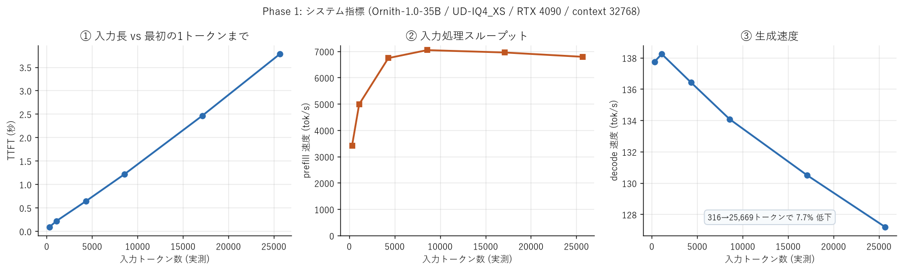
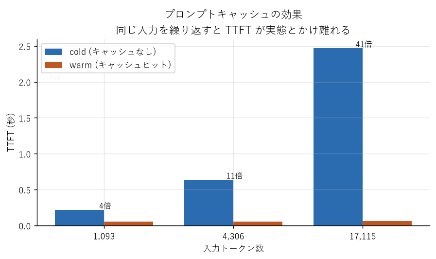
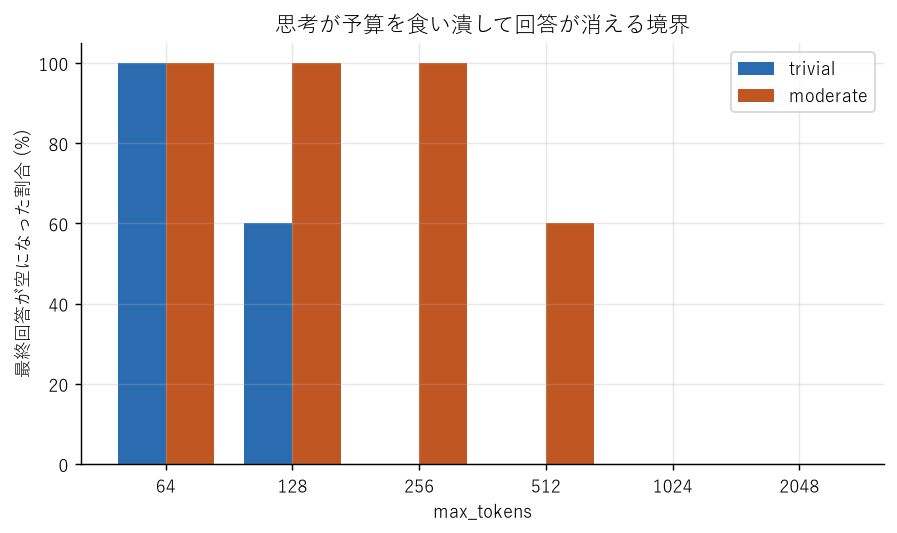
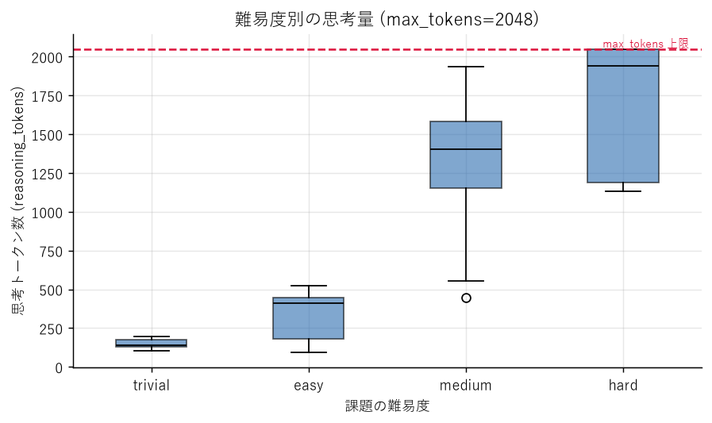

# Phase 1・2 計測結果

計測日: 2026-09-05

用語の解説は [用語集](glossary.md) を参照。

## 計測条件

```
モデル        : unsloth/Ornith-1.0-35B-GGUF/Ornith-1.0-35B-UD-IQ4_XS.gguf
                (DeepReinforce Team / MIT / エージェント型コーディング特化)
アーキテクチャ  : qwen35moe (MoE) / vision: true / trainedForToolUse: true
量子化        : UD-IQ4_XS (Unsloth Dynamic、レイヤーごとにビット幅可変)
コンテキスト    : 32,768 (ネイティブ 262,144 の 1/8)
サンプリング    : temperature 0.6 / top_p 0.95 / top_k 20 (モデルカード推奨値)
サーバー       : LM Studio (port 1235) / 全40レイヤーGPUオフロード / Flash Attention 有効
ハードウェア    : RTX 4090 (VRAM 24GB) / Intel i9-14900KF / RAM 64GB
OS設定        : CUDA sysmem fallback 無効
試行数        : Phase 1 は N=5、Phase 2 は N=5 (予算スイープ) / N=3 (難易度ラダー)
```

計測値は LM Studio の `/api/v0/chat/completions` が返す `stats` を使用（サーバー側計測）。

---

## Phase 1: システム指標



N=5 の中央値:

| 入力トークン | TTFT | prefill | decode | VRAM残 |
|---:|---:|---:|---:|---:|
| 316 | 0.092s | 3,418 tok/s | 137.8 tok/s | 3,284 MiB |
| 1,097 | 0.220s | 4,988 tok/s | 138.2 tok/s | 3,284 MiB |
| 4,308 | 0.639s | 6,741 tok/s | 136.4 tok/s | 3,284 MiB |
| 8,568 | 1.216s | 7,044 tok/s | 134.1 tok/s | 3,284 MiB |
| 17,117 | 2.462s | 6,954 tok/s | 130.5 tok/s | 3,284 MiB |
| 25,669 | 3.780s | 6,790 tok/s | 127.2 tok/s | 3,284 MiB |

### 分かったこと

**生成速度は 138 tok/s、25k トークンでも 127 tok/s。**
35B というパラメータ数から想像するより速い。MoE でトークンごとに一部のエキスパートしか動かないため、実際に計算されるアクティブパラメータが 35B よりずっと小さいことによる。

**コンテキストが伸びると decode は 7.7% 低下する。** 緩やかで、実用上は問題にならない範囲。

**prefill は約 7,000 tok/s で頭打ち。** 短い入力で見かけ上遅くなるのは固定オーバーヘッドの影響で、実際の処理能力ではない。TTFT は入力長にほぼ線形に伸びる（25,669 トークンで 3.78 秒）。

**VRAM は入力長によらず一定。** 316 トークンでも 25,669 トークンでも空きは 3,284 MiB のまま 1 MiB も動かなかった。LM Studio はロード時に 32k 分の KV キャッシュを確保しており、実行中には増えない。**長い入力で実行中にVRAMが枯渇する心配は不要**で、可否はロード時点で決まる。

**sysmem fallback 無効下でも 25,669 トークンが完走した。** VRAM の実上限には届いていない。

---

## プロンプトキャッシュ — 最初の計測を無効にした落とし穴



| 入力トークン | cold TTFT | warm TTFT | 高速化 |
|---:|---:|---:|---:|
| 1,093 | 0.220s | 0.057s | **3.9倍** |
| 4,306 | 0.639s | 0.057s | **11.2倍** |
| 17,115 | 2.470s | 0.060s | **41.0倍** |

LM Studio は既定でプロンプトの接頭辞をキャッシュする。**warm 側は入力長によらず約 0.06 秒**で一定になり、入力が長いほど実態との乖離が広がる。

### 実際に踏んだ失敗

最初の計測では、各条件で同じプロンプトを5回送っていた。結果:

- 2回目以降の TTFT が入力長に関係なく一律 **0.058秒**
- prefill 速度が **419,000 tok/s** という物理的にありえない値に

さらに、ダミー入力を共通の雛形から生成していたため、**24k のプロンプトが 16k のプロンプトの接頭辞を丸ごと含んでいた**。条件をまたいでキャッシュが効き、24k の初回（1.462秒）が 16k の初回（2.422秒）より速いという逆転まで起きていた。

**対策**：実行ごとにプロンプトの**先頭**を一意にする。キャッシュは接頭辞で一致するため、末尾を変えても効果がない。

なお **decode 速度と思考トークン量はキャッシュの影響を受けない**（キャッシュが効くのは入力処理のみ）。

無効データは `results/phase1_systems_INVALID_cached.csv` に保存してある。

---

## Phase 2: reasoning トークンの分析

### A) 思考が予算を食い潰して回答が消える境界



最終回答が空になった割合（N=5）:

| max_tokens | 自明な課題 | 中程度の課題 |
|---:|---:|---:|
| 64 | 100% | 100% |
| 128 | 60% | 100% |
| 256 | **0%** | 100% |
| 512 | 0% | 60% |
| 1024 | 0% | **0%** |
| 2048 | 0% | 0% |

「PONG とだけ答えて」という**自明な課題ですら 256 トークンの予算が必要**。中程度の課題では 1024 必要だった。

この空応答は `finish_reason: "length"` かつ `content: ""` として返る。**HTTP エラーにはならない**ため、検出処理を入れていない評価スクリプトはこれを「不正解」として集計してしまう。

### B) 難易度別の思考量



| 難易度 | 思考トークン中央値 | 範囲 | 回答トークン中央値 |
|---|---:|---|---:|
| 自明 | 142 | 106〜196 | 4 |
| 簡単 | 410 | 93〜523 | 6 |
| 中程度 | 1,403 | 444〜1,935 | 107 |
| 難問 | 1,940 | 1,132〜2,048 | 108 |

**思考と回答の比率が極端。** 自明な課題では思考 142 トークンに対して回答は 4 トークン。**35倍の計算を、4トークンを出すために使っている**。

⚠️ **難問では 2048 でも足りない。** 難問9回のうち **6回が上限 2048 に到達**し、うち3回は最終回答が空になった。中程度でも9回中2回が到達している。

つまり上表の難問の中央値 1,940 は**打ち切られた値**であり、実際に必要な思考量はこれより多い。

---

## 評価設計への反映

1. **`max_tokens` は 4096 以上**。コーディング課題は難問に相当するため、2048 では約3分の1が空応答になる
2. **空応答の検出は必須**。ただし `finish_reason: "tool_calls"` の空 `content` は正常なので除外する
3. **プロンプトキャッシュを無効化**しない限り TTFT は測れない
4. **エラー処理は2系統**。存在しないパスは HTTP 200 + ボディの `error`、コンテキスト超過は HTTP 400

## 生データ

| ファイル | 内容 |
|---|---|
| `results/phase1_systems.csv` | Phase 1 の全実行 |
| `results/phase1_prompt_cache.csv` | cold/warm 比較 |
| `results/phase2a_budget_sweep.csv` | 予算スイープ全実行 |
| `results/phase2b_difficulty.csv` | 難易度ラダー全実行 |
| `results/phase1_systems_INVALID_cached.csv` | キャッシュ汚染された無効データ（参考用） |
| `data/` | 全リクエストの生レスポンス JSON |
