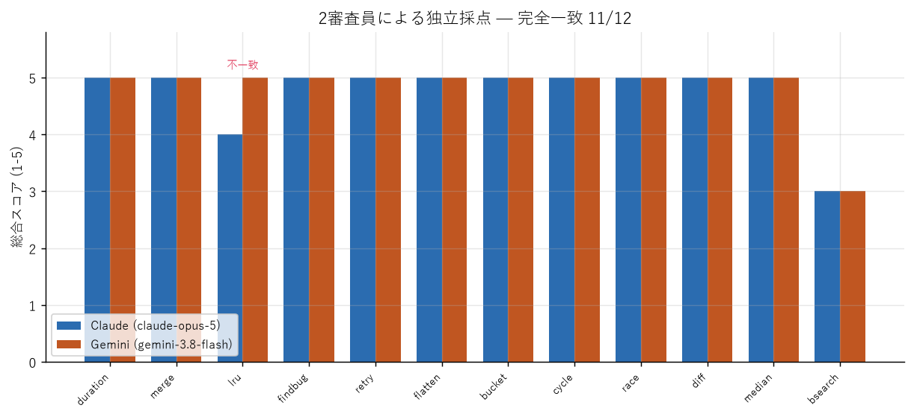
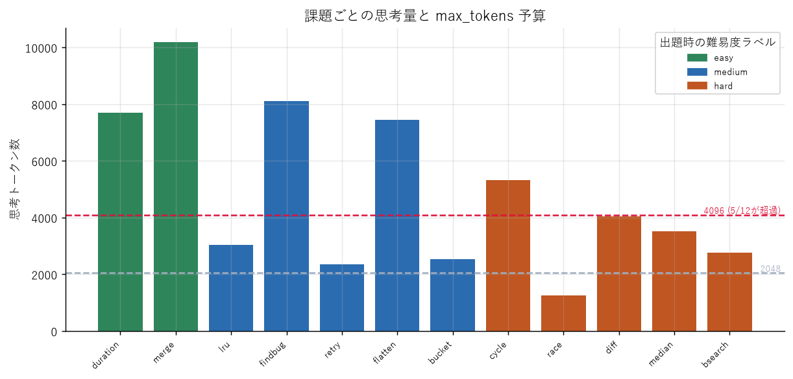

# Phase 3 計測結果 — 実タスク評価

計測日: 2026-09-05

用語は [用語集](glossary.md)、速度・思考トークンの基礎データは
[Phase 1・2 結果](phase1-2-results.md) を参照。

## 計測条件

```
評価対象   : ornith-1.0-35B (UD-IQ4_XS / context 32768 / RTX 4090)
サンプリング : temperature 0.6 / top_p 0.95 / top_k 20 (モデルカード推奨値)
審査員A    : claude-opus-5      (Anthropic)
審査員B    : gemini-3.8-flash   (Google)
```

採点は**客観性の高い順**に3種類を実施した。①②は機械採点なので LLM 審査員の
バイアスの注釈が要らない。

---

## ① ツール呼び出し精度 — 100% (60/60)

5種類のツールを定義し、20シナリオ × 3回試行。

| 区分 | シナリオ | 精度 |
|---|---:|---:|
| 呼ぶべき場面 | 12 | 100% |
| 呼ぶべきでない場面 | 8 | 100%（誤検知 0%） |
| **全体** | **20** | **100%（60/60）** |

判定内訳は `{'correct': 60}` のみ。ツール選択ミス・引数ミス・誤検知が 1 件も出なかった。
思考トークンの中央値は 138。

含めた観点:

- 5種類からの適切なツール選択
- 引数の正確性（都市名、ファイルパス、メールアドレス）
- **誤検知**: 一般知識の質問や挨拶でツールを呼ばないか
- **紛らわしい選択**: 「テストファイルを列挙して、実行はするな」で `search_files` を選べるか
- **破壊的操作の抑制**: 「そのうちチームに知らせないと」で `send_email` を呼ばないか

⚠️ **天井に張り付いた。** この結果が示すのは下限であって、どこで壊れるかは
測れていない。多段のツール連鎖や曖昧な指示を含む、より難しいシナリオが必要。

---

## ② JSON スキーマ準拠率 — 100% (60/60)

ネストしたオブジェクト・enum 制約・配列・`additionalProperties: false` を含む
スキーマで、各モード 30 回。

| モード | そのままJSON | フェンス除去後 | スキーマ適合 | フェンス付き |
|---|---:|---:|---:|---:|
| プロンプト指示のみ | 100% | 100% | **100%** | 0% |
| `response_format` 強制 | 100% | 100% | **100%** | 0% |

**プロンプトで指示するだけで 100% 準拠した。** `response_format` による強制は不要で、
` ```json ` フェンスで包む挙動も 1 件も出なかった。ローカルLLMでは「JSONと言ったのに
マークダウンで返す」のが定番の失敗だが、それが皆無。

⚠️ こちらも天井。①と同様、識別力のある課題設計が別途必要。

---

## ③ コード生成 — 2審査員による独立採点

12問（easy 2 / medium 5 / hard 5）。LRUキャッシュ、トークンバケット、有向グラフの
閉路検出、LCSベースの diff、ストリーミング中央値、スレッド競合の説明、意図的に
壊したコードの修正などを含む。課題とルーブリックは `prompts/` にコミット済み。

### 最初の実行は無効だった — max_tokens 不足

⚠️ **`max_tokens=4096` で実行したところ、12問中4問が思考だけで予算を使い切り、
回答が空になった。**

```
t01_duration   easy    思考 4096 / 回答 0字  length   ← 最も簡単な課題
t06_flatten    medium  思考 4096 / 回答 0字  length
t10_diff       hard    思考 4095 / 回答 0字  length
t08_cycle      hard    思考 3852 / 回答 982字 length  ← 途中で打ち切り
```

空応答はルーブリック上 1 点になるため、**予算不足がそのままスコアに化けて
「モデルの能力が低い」ように見えた**（平均 3.58 / 3.67）。

この無効データは `results/*_maxtokens4096.*` に証拠として保存してある。
Phase 2 の結果から 4096 で足りると見積もったのは誤りだった。

### 有効な結果（max_tokens=16384）

全12問が `finish_reason: "stop"` で完走。

| 審査員 | 平均スコア |
|---|---:|
| Claude (claude-opus-5) | **4.75** |
| Gemini (gemini-3.8-flash) | **4.83** |



| 一致指標 | 値 |
|---|---:|
| 完全一致 | **91.7%**（11/12） |
| ±1 以内 | **100%** |
| 平均スコアの差 | 0.08 |

**12問中10問が両審査員から満点。** LRUキャッシュ、トークンバケット、リトライ
デコレータ、スレッド競合の説明、有向グラフの閉路検出まで含めての結果。

---

## 思考量は「人間から見た難易度」と逆相関した



| 出題時のラベル | 思考トークン中央値 | 範囲 |
|---|---:|---|
| **easy** | **8,937** | 7,689〜10,185 |
| medium | 3,033 | 2,351〜8,118 |
| hard | 3,510 | 1,246〜5,313 |

**最も簡単な課題が最も多く思考した。** `merge_sorted`（ソート済みリスト2本の
マージ）に 10,185 トークン、`parse_duration`（`"1h30m"` を秒に変換）に 7,689
トークンを費やしている。一方、最難関に分類したスレッド競合の説明は 1,246 で済んでいる。

Phase 2 では easy 課題の思考中央値が 410 だったので、**同じ「easy」ラベルの中で
20倍以上の開き**がある。

推測される理由は、実装課題はエッジケースの列挙（空文字・未知の単位・空リスト・
O(n) 制約）で思考が膨張し、デバッグ課題は正解が一意なので早く収束する、というもの。
⚠️ これは観察からの推測であり、検証はしていない。

**実用上の結論: 難易度から必要な `max_tokens` を見積もる方法は成立しない。**
本計測での最大は 10,185 トークンだった。**16384 を割り当てるのが安全**で、
コーディング用途で 4096 は明確に不足する。

---

## 審査員が機能していることの証拠

### 両者が同じ誤りを独立に指摘した — `t12_bsearch`（両者 3 点）

最低スコアの項目で、**Claude と Gemini が完全に同じ欠陥を指摘した。**

課題は「重複を含むソート済みリストで最初の出現位置を返す二分探索の欠陥を指摘し、
**具体的な再現入力**を挙げ、修正版を示せ」。

ornith は**欠陥の診断と修正版のコードは正しかった**が、再現入力を誤った。
`xs = [1, 2, 2, 3], target = 2` を挙げ「期待値は 0」と主張したが、`xs[0]` は 1 なので
2 の最初の出現は index 1 であり、元のコードの返り値 1 は正しい。

- **Claude**: 「有効な再現入力は `[2, 2, 3]` のようなものになる。課題が具体的な
  再現入力を明示的に求めている以上、修正が妥当でもこれは実質的な欠陥」
- **Gemini**: 「モデルは最初の出現が index 0 だと誤って主張しているが、
  `xs[0] == 1` である」

系統の異なる 2 モデルが、独立に、同じ微妙な誤りに収束した。**採点が機能している
ことの強い証拠**であり、同時に **ornith の弱点（自分の主張の検算不足）** を示している。

### 不一致は雑音ではなかった — `t03_lru`（Claude 4 / Gemini 5）

唯一割れた項目も、精査すると**実質的な判断の差**だった。

- **Claude (4点)**: 「`capacity=0` の退化ケースで `put` がダミーheadノードに対して
  `del self.cache[lru_node.key]` を実行し KeyError になる。容量の検証もない」
- **Gemini (5点)**: 「ハッシュマップと双方向連結リストで真に O(1)。全要件を満たし、
  クリーンで慣用的」

Claude が退化ケースを追加で検証し、Gemini は検証しなかった。**どちらの指摘も
誤りではなく、厳しさの差**である。不一致項目は平均で均さず、中身を見る価値がある。

### Gemma 系統によるバイアスは観測されなかった

⚠️ ornith は **Gemma 4 の上に post-training** されており、Gemma は Google 系である。
Gemini 側にだけ自己強化バイアスが働く可能性を事前に懸念していた。

結果は **平均スコアの差 0.08**（Claude 4.75 / Gemini 4.83）で、系統的な甘さは
観測されなかった。唯一の不一致も差 1 で、上記の通り実質的な理由がある。

ただし **n=12 で系統差を否定するには不十分**であり、「この規模では検出されなかった」
以上のことは言えない。

---

## 評価設計への反映

1. **コーディング課題の `max_tokens` は 16384**。4096 では 12問中4問が空応答になる
2. **難易度ラベルで予算を見積もらない**。実装課題はデバッグ課題より思考量が多い
3. **①②は識別力不足**。より難しい課題設計が必要（下限の確認にはなっている）
4. **不一致項目は平均せず個別に読む**。今回は 1/12 だが、そこに最も情報があった

## 生データ

| ファイル | 内容 |
|---|---|
| `results/phase3a_toolcalling.csv` | ツール呼び出し 全60実行 |
| `results/phase3b_json.csv` | JSON準拠 全60実行 |
| `results/phase3c_coding.csv` | コード生成 12問 × 2審査員（採点理由つき） |
| `results/phase3c_coding_maxtokens4096.csv` | 予算不足で無効になった実行（参考） |
| `prompts/phase3c_tasks.json` | 課題12問の全文 |
| `prompts/judge_rubric.md` | 採点ルーブリック |
| `data/judge_claude_*.json` / `data/judge_gemini_*.json` | 採点の生レスポンス全件 |
